# Aplicando Testes

Este repositório contém a implementação de três tipos de testes em aplicações .NET 5, seguindo o tutorial proposto. Cada teste foi versionado individualmente, com um commit específico para cada implementação.

## Índice

- [Testes de Unidade](#testes-de-unidade)
  - [Aplicação dos Testes](#aplicação-dos-testes)
  - [Cenários de Exemplo](#cenários-de-exemplo)
  - [Execução dos Testes](#execução-dos-testes)
- [Mock Objects](#mock-objects)
  - [Aplicação dos Testes](#aplicação-dos-testes-1)
  - [Cenários de Exemplo](#cenários-de-exemplo-1)
  - [Execução dos Testes](#execução-dos-testes-1)
- [SpecFlow e BDD](#specflow-e-bdd)
  - [Aplicação dos Testes](#aplicação-dos-testes-2)
  - [Cenários de Exemplo](#cenários-de-exemplo-2)
  - [Execução dos Testes](#execução-dos-testes-2)
- [Observações](#observações)
- [Conclusão](#conclusão)

---

## Testes de Unidade

### Aplicação dos Testes

Os testes de unidade foram implementados utilizando os frameworks **xUnit**, **NUnit** e **MSTest** em projetos que realizam a conversão de temperaturas de Fahrenheit para Celsius. Esses testes visam validar individualmente cada unidade funcional do código, garantindo que cada método produza o resultado esperado de forma isolada.

### Cenários de Exemplo

#### Conversão Correta de Temperaturas

- **Entrada:** 32°F
- **Processamento:** Conversão para Celsius usando a fórmula C = (F - 32) × 5/9
- **Resultado Esperado:** 0°C

#### Verificação de Valores Limites

- **Entrada:** -40°F
- **Processamento:** Conversão para Celsius
- **Resultado Esperado:** -40°C (ponto em que as escalas Fahrenheit e Celsius se igualam)

### Execução dos Testes

Após clonar os repositórios correspondentes:

- `DotNet5-xUnit`
- `DotNet5-NUnit`
- `DotNet5-MSTest`

Executamos os comandos:

```bash
dotnet restore
dotnet build
dotnet test
```


1. git clone https://github.com/renatogroffe/DotNet5-xUnit.git

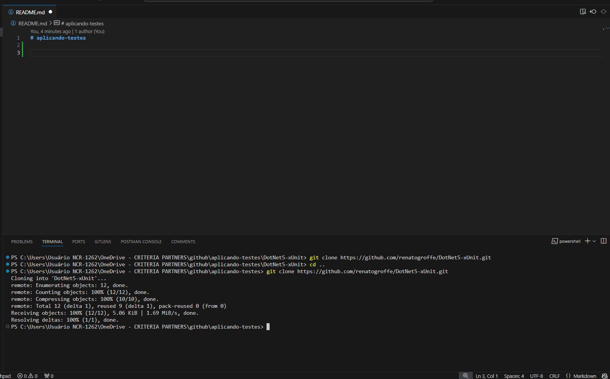

2. git clone https://github.com/renatogroffe/DotNet5-NUnit.git

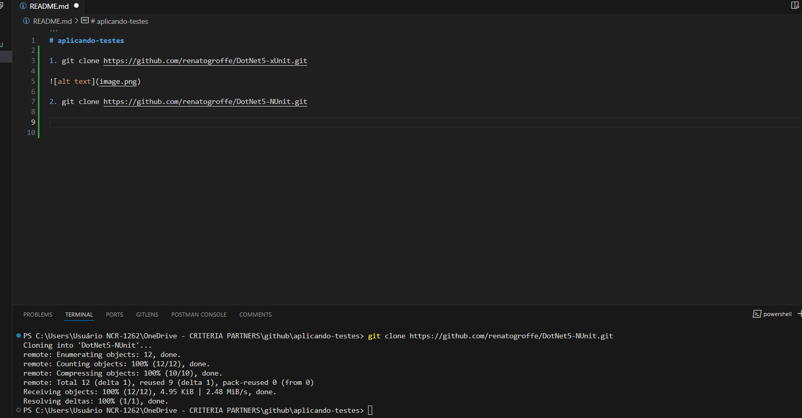

3. git clone https://github.com/renatogroffe/DotNet5-MSTest.git

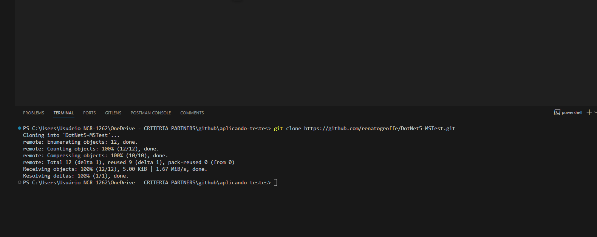


4. Execução testes DotNet-xUnit

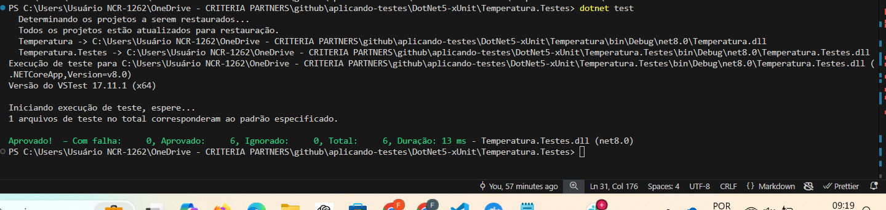

5. Execeução testes DotNet-NUnit

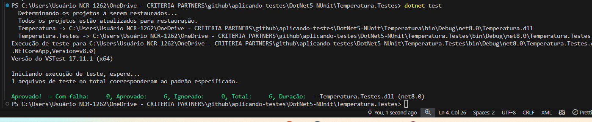


6. Execução testes DotNet5-MSTest

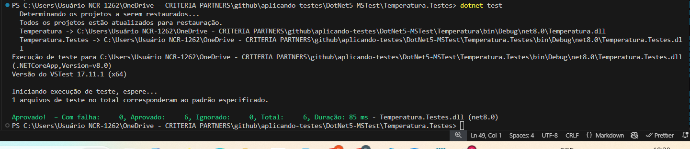


## Mock Objects

### Aplicação dos Testes

Os Mock Objects foram utilizados para simular o comportamento de objetos reais em cenários controlados, empregando os frameworks Moq e NSubstitute juntamente com xUnit e Fluent Assertions. Isso permite testar componentes de forma isolada sem depender de suas implementações concretas, facilitando a identificação de possíveis falhas.

### Cenários de Exemplo

#### Simulação de Serviço Externo Bem-Sucedido

- **Descrição:** O mock simula uma resposta bem-sucedida de um serviço externo de consulta de crédito.
- **Resultado Esperado:** O sistema processa a resposta e aprova a operação.


#### Simulação de Falha no Serviço Externo
- **Descrição:** O mock simula uma falha na comunicação com o serviço externo.
- **Resultado Esperado:** O sistema captura a exceção e registra o erro adequadamente.


### Execução dos Testes

Repositórios clonados:

- `DotNet5-Moq-xUnit-FluentAssertions`
- `DotNet5-NSubstitute-xUnit-FluentAssertions`

7. git clone https://github.com/renatogroffe/DotNet5-Moq-xUnit-FluentAssertions.git

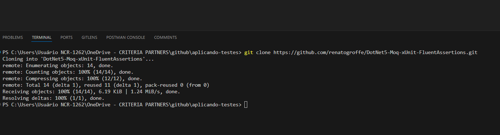

8. git clone https://github.com/renatogroffe/DotNet5-NSubstitute-xUnit-FluentAssertions.git

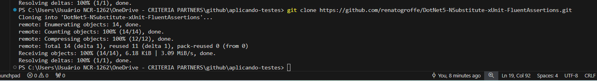

9. Execeução testes DotNet5-NSubstitute-xUnit-FluentAssertions

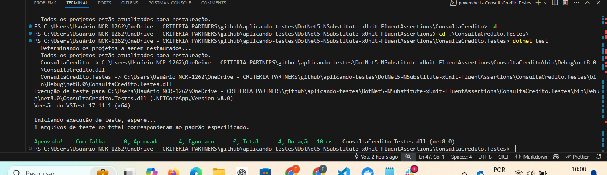

10. Execução testes DotNet5-Moq-xUnit-FluentAssertions

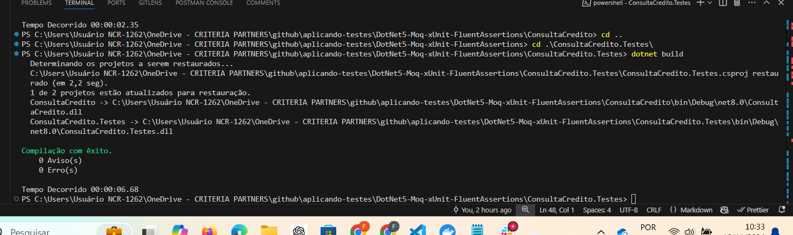

## SpecFlow e BDD

### Aplicação dos Testes
Para os testes de aceitação, utilizamos o SpecFlow que permite escrever testes em formato de linguagem natural seguindo a metodologia BDD (Behavior Driven Development). Isso facilita a comunicação entre desenvolvedores, testadores e stakeholders, garantindo que todos tenham um entendimento comum das funcionalidades implementadas.

### Cenários de Exemplo

#### Cálculo de Juros Compostos

- **Funcionalidade:** Como usuário, desejo calcular os juros compostos de um investimento.
- **Cenário:** Dado um capital de R$1.000,00, uma taxa de juros de 2% ao mês e um período de 12 meses.
- **Resultado Esperado:** O sistema retorna o montante de R$1.268,24.

#### Conversão de Temperaturas via API
- **Funcionalidade:** Como usuário, quero converter temperaturas entre diferentes escalas através de uma API.
- **Cenário:** Quando envio uma requisição para converter 100°C para Fahrenheit.
- **Resultado Esperado:** O sistema responde com 212°F.


### Execução dos Testes

Repositórios clonados:

- `ASPNETCore5-REST_API-xUnit-SpecFlow-Swagger-Docker_JurosCompostos`
- `ASPNETCore5-REST_API-SpecFlow-xUnit-Docker_ConversorTemperaturas`

11. git clone https://github.com/renatogroffe/ASPNETCore5-REST_API-xUnit-SpecFlow-Swagger-Docker_JurosCompostos.git

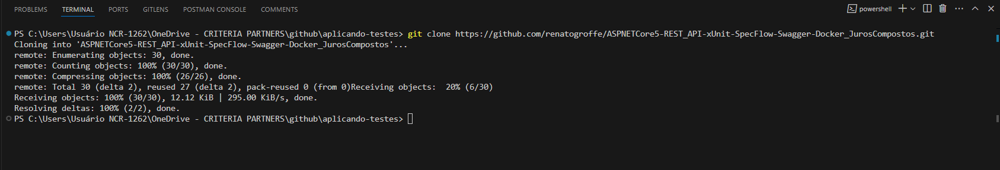

12. git clone https://github.com/renatogroffe/ASPNETCore5-REST_API-SpecFlow-xUnit-Docker_ConversorTemperaturas.git

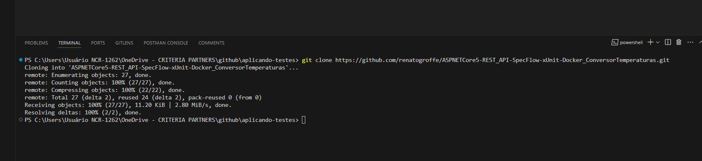

Execução dos testes com SpecFlow:

13. Execução testes ASPNETCore5-REST_API-xUnit-SpecFlow-Swagger-Docker_JurosCompostos

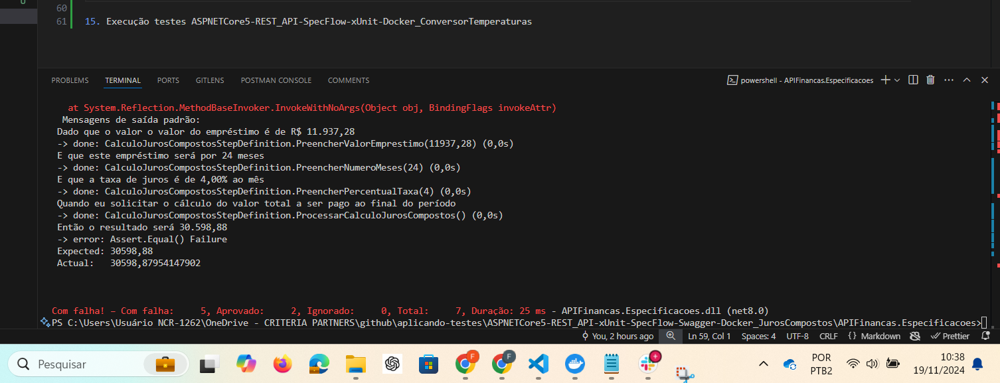

14. Execução testes ASPNETCore5-REST_API-SpecFlow-xUnit-Docker_ConversorTemperaturas

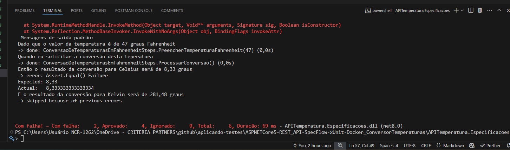


## Observações
- Utilizamos a versão do .NET 8 para evitar erros de compatibilidade durante a restauração, build e execução dos testes.
- Cada commit no repositório corresponde à implementação de um teste específico, permitindo um histórico detalhado das alterações.

## Conclusão

Através da implementação dos testes de unidade, mock objects e testes de aceitação com SpecFlow, garantimos a qualidade e confiabilidade das aplicações desenvolvidas. Esses testes são fundamentais para identificar e corrigir possíveis erros, além de assegurar que as funcionalidades atendam aos requisitos especificados.


